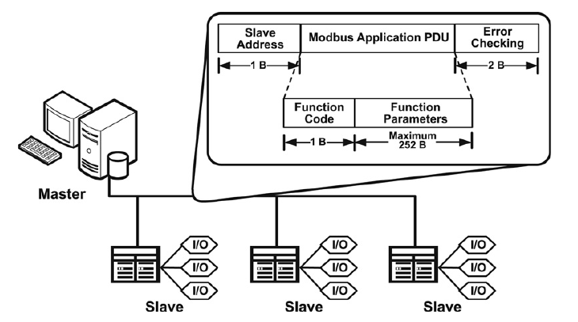
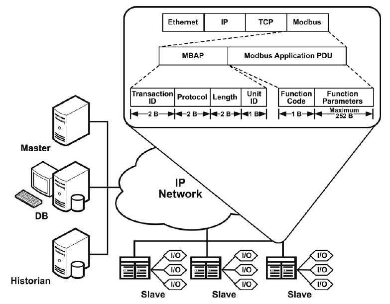
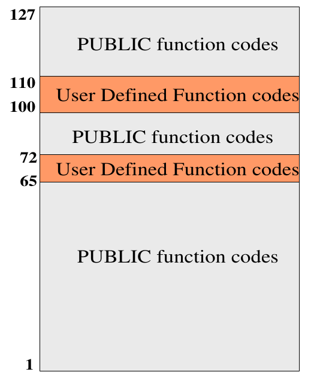
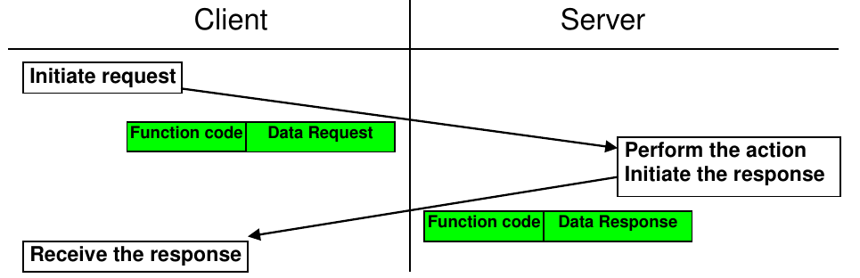
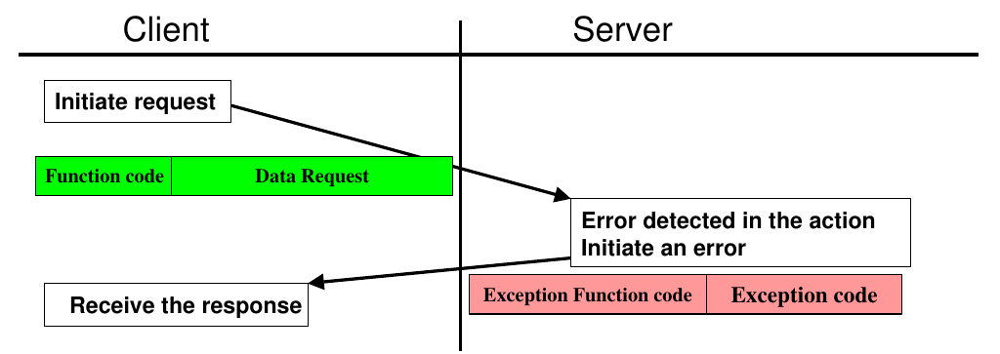
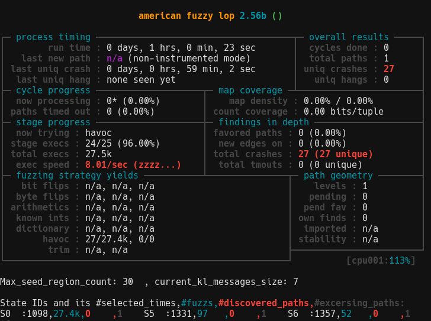

# HAVING FUN WITH MODBUS

***20/02/2022***

TODO: INSERT abstract

## 1. Modbus

Having been around since 1979 \[[1]\], there are countless posts / papers about this protocol out there already. So in this part, even through I once again covering it\'s details, the infomation should be short and to the point as much as possible. I will put reference links in case you want to read more.

### 1.1 Modbus frame & ADU

***TL;DR***:

- A Modbus "frame" consists of an Application Data Unit (ADU), which encapsulates a Protocol Data Unit (PDU):
  - ADU = Address + PDU + Error check,
  - PDU = Function code + Data.

Supported by almost if not all industrial automation devices, the modbus protocol is simple to implement and versatile in transfer channel. Most used are modbus TCP and modbus serial (RS232, RS485).


*Figure 1.1. Modbus serial architecture \[[3]\]*

Modbus RTU frame format

|Name|Length (bytes)|Function|
|:-|:-|:-|
|Start|3.5|28 bits time of silence between frames|
|Address|1|Slave address|
|Function|1|Function code|
|Data|n|Data (n max = 252)|
|CRC|2|CRC|
|End|3.5|28 bits time of silence between frames|

The figure above desscribe the architecture of a modbus-based master-slave system using a single serial bus as transfer channel.

The modbus data packet (frame) itself contains 1 byte of slave address for slave identification, 2 bytes for CRC and the PDU (Protocol Data Unit - contains modbus control data). The whole of this modbus frame is called ADU (Application Data Unit). Each transfer protocol have an ADU tailored for them, like this ADU for serial and another ADU for TCP which you will see shortly.

Modbus serial also have a "silence period" between each frame \[[1]\] that is not shown in the figure.


*Figure 1.2. Modbus TCP/IP architecture \[[3]\]*

Modbus TCP frame format

|Name|Length (bytes)|Function|
|:-|:-|:-|
|Transaction identifier|2|For synchronization between messages of server and client |
|Protocol identifier|2|0 for Modbus/TCP|
|Length field|2|Number of remaining bytes in this frame|
|Unit identifier|1|Server address (255 if not used)|
|Function code|1|Function code|
|Data|n|Data (n max = 252)|

Here in TCP/IP environment, the modbus frame riding on TCP have a different ADU structure compare to serial counterpart. Only include a header - MBAP header and the PDU.

MBAP fields:

- Transaction ID help identify modbus request order. That is, a master can send requests 1, 2, and 3. At some later point, a slave can respond in the order 2, 1, 3. Master can then match it to appropriate request.
- The protocol identifier is normally zero, but you can use it to expand the behavior of the protocol.
- The length field is used by the protocol to delineate the length of the remaining of the packet.
- The Unit ID is typically unused for TCP/IP devices. However, Modbus is such a common protocol that many gateways are developed, which convert the Modbus protocol into another protocol. In the original intended use case, a Modbus TCP/IP to serial gateway could be used to allow connection between new TCP/IP networks and older serial networks. In such an environment, the Unit ID is used to determine the address of the slave device that the PDU is actually intended for.

***NOTE:*** You might come across the terms MODBUS RTU / TCP / ASCII. Those are frame formats. You have seen modbus RTU that transfer through serial and modbus TCP above. Modbus ASCII frame is also used with serial connection but unlike binary data of modbus RTU, the data of ASCII frame is... ASCII and fully readable.

### 1.2 Data objects

Before getting into PDU structure, I will go through how data is stored within a modbus compatible device.

Modbus protocol define 4 memory blocks, shown in table below. Each with different size / access right. This however is purely defined by protocol. Device manufacturer can decide their own implementation of these data blocks. Says coils and discrete input refer to the same memory location for example.

|Memory Block|Data Type|Master Access|Slave Access|
|:-|:-|:-|:-|
|Coils|Boolean|Read/Write|Read/Write|
|Discrete Inputs|Boolean|Read-only|Read/Write|
|Holding Registers|Unsigned Word (2 bytes)|Read/Write|Read/Write|
|Input Registers|Unsigned Word (2 bytes)|Read-only|Read/Write|

Each memory block is addessed with 16 bit address, means each can have up to 65536 distinct elements (0 -> 65535). The indexing scheme is start from 1, so coil 1 means coil that has address 0.

The device also might not implement all possible element in each memory block. E.G. a device might have only 2 coils and 3 holding register for example.

Also, to access the memory block. Data address have a distinct prefix for each block, shown below. Example, to access Discrete Inputs number 3 -> address 100002.

|Data Block|Prefix|
|:-|:-|
|Coils|0|
|Discrete Inputs|1|
|Input Registers|3|
|Holding Registers|4|

These memory blocks are the building block of all other complex data manufacturer might come up with. Check your device manual.

### 1.3 Modbus PDU & command transmission

This piece of data within modbus frame is the one that control your device operation. Modbus master can send commands in order to read/manipulate memory blocks, inturn, control the device.

The PDU consists of 1 byte function code and upto 252 bytes of additional data.

3 types:

- Public codes: Well defined function code and accompanying data in modbus standard (Check modbus specification documentation \[[2]\] - section 5 & 6).
  - Reserved codes: Some public code may get reserved for future use
- User defined codes: Defined by device manufacturers.

Function code number ranges are defined as follow.


*Figure 1.3. Modbus function code ranges \[[2]\]*

A typical modbus data transaction happen as follow:


*Figure 1.4. Modbus transaction without error \[[2]\]*

If no error occur, the slave returns a *positive* response.

- The response function code = the request function code

If errors were to occur. The slave returns a *negative* response.

- The exception function code = the request function code + 128 (result in 128 to 255 range)
- Modbus exception for each function code is defined, check \[[2]\] section 6 for each function code and section 7 for each exception code.


*Figure 1.5. Modbus transaction with error \[[2]\]*

***NOTE:*** The modbus specification dictates that data in the PDU is big endian.

## 2. Fuzzing modbus

When pentesting new modbus device, being able to identify all supported/hidden functions is important. From all we learnt from section 1, its simple data structure makes prime target for fuzzing. In this post I'll test 3 tools that might help with function discovery as well as actual fuzzing workload. All with 1 hour of fuzzing to see if they can identify an \'untintentional\' bug, not really long enough for benchmarking but should be enough for a PoC.

### 2.1 Creating test devices

Before going into the tools, lets create our poor-man modbus device first. There is no fun in spending big money for a real-world industrial device just to tinker with (unless thats your goal :)).
There are many way you can take to create a low-cost modbus test device. Options are listed:

- low-cost dev boards:
  - Arduino:
    - ArduinoModbus library
  - Esp8266 / esp32:
    - modbus-esp8266 library
- C
  - libmodbus
- Python
  - [Modbus libraries](https://minimalmodbus.readthedocs.io/en/stable/related.html)
- For quick and dirty testing:
  - pymodbus also have [REPL \(Read Evaluate Print Loop\)](https://pymodbus.readthedocs.io/en/latest/source/library/REPL.html)
  - Also recommended by \[5\] is [modbus test utility](https://forumautomation.com/t/modbus-test-utility-free-alternative-to-modscan-modbus-poll-simply-modbus/2828)

For our testing purposes, I will reuse the pymodbus program from \[[5]\]. Copy and paste will do. This program will ***\'crash\'*** when master(client) read from any input register with address higher than 0xff.

```py
#!/usr/bin/env python3

from pymodbus.datastore import ModbusSequentialDataBlock
from pymodbus.server.sync import StartTcpServer
from pymodbus.datastore import ModbusSlaveContext, ModbusServerContext

import logging
import os

##
# A sloppy data block: someone forgot to check some address bounds
# somewhere, and reading input registers past 0xFF is going to cause
# this device to crash!
class BadDataBlock(ModbusSequentialDataBlock):
    def __init__(self):
        self.values = [0x00] * 0xFFFF
        super().__init__(0, self.values)

    def getValues(self, addr, count):
        # Uh-oh...
        if (addr <= 0xFF):
            return self.values[addr:addr+count]
        else:
            os._exit(1)

def run_server():

    bad_block = BadDataBlock()

    store = ModbusSlaveContext(
        di=ModbusSequentialDataBlock(0, [0xFF] * 32),
        co=ModbusSequentialDataBlock(0, [0xFF] * 32),
        hr=ModbusSequentialDataBlock(0, [0xFF] * 32),
        ir=bad_block)

    context = ModbusServerContext(slaves=store, single=True)

    StartTcpServer(context, address=("localhost", 5020))

def main():
    FORMAT = ('%(asctime)-15s %(threadName)-15s'
                    ' %(levelname)-8s %(module)-15s:%(lineno)-8s %(message)s')
    logging.basicConfig(format=FORMAT)
    log = logging.getLogger()
    log.setLevel(logging.DEBUG)
    run_server()

if __name__ == "__main__":
    main()
```

### 2.2 [Boofuzz](https://boofuzz.readthedocs.io/en/stable/index.html)

***This part follow setup in \[[5]\]. Its a nice short guide of how to use boofuzz for modbus. Recommended.***

Boofuzz is a fuzzer specialized in fuzzing network protocol. You can define any protocol structure and keyword for fuzzing. In modbus case, that is not necessary however, since the fields are all binary value. This makes the job easier for us.

Fuzzer code from \[[5]\]. Everything is explained nicely.

```python
#!/usr/bin/env python3

from boofuzz import *

def main():
    session = Session(target=Target(connection=TCPSocketConnection("127.0.0.1", 5020)),
                      restart_threshold=1, restart_timeout=1.0)

    ##
    # Modbus TCP header:
    # * 2-byte transaction id
    # * 2-byte protocol id, must be 0000
    # * 2-byte message length
    # * 1 byte unit ID
    #
    # followed by request data:
    # * 1 byte function ID
    # * 2-byte starting address
    # * 2-byte number of registers
    s_initialize(name="Read Input Registers")

    if s_block_start("header"):
        # Transaction ID
        s_bytes(value=bytes([0x00, 0x01]), size=2, max_len=2, name="transaction_id")
        # Protocol ID. Fuzzing this usually doesn't provide too much value so let's leave it fixed.
        # We can also use s_static here.
        s_bytes(value=bytes([0x00, 0x00]), size=2, max_len=2, name="proto_id", fuzzable=False)
        # Length. Fuzzing this is generally useful but we'll keep it fixed to make this tutorial's
        # data set easier to explore.
        s_bytes(value=bytes([0x00, 0x06]), size=2, max_len=2, name="len", fuzzable=False)
        # Unit ID. Once again, fuzzing this usually doesn't provide too much value.
        s_bytes(value=bytes([0x01]), size=1, max_len=1, name="unit_id", fuzzable=False)
    s_block_end()

    if s_block_start("data"):
        # Function ID. Fixed to Read Input Registers (04)
        s_bytes(value=bytes([0x04]), size=1, max_len=1, name="func_id", fuzzable=False)
        # Address of the first register to read
        s_bytes(value=bytes([0x00, 0x00]), size=2, max_len=2, name="start_addr")
        # Number of registers to read
        s_bytes(value=bytes([0x00, 0x01]), size=2, max_len=2, name="reg_num")
    s_block_end()

    session.connect(s_get("Read Input Registers"))

    session.fuzz()

if __name__ == "__main__":
    main()
```

In my test runs, time to reach crash condition differ from run to run, but overall relatively quick.
This code does not implement any form of crash detection or restarting server code. Boofuzz supports numbers of callbacks and monitors that can be used for monitor both local and remote target. For local target, ProcessMonitor should be used. For remote target however, there is no dedicated monitor. User must use callback to determine if target has crashed or not.

### 2.3 [Aflnet](https://github.com/aflnet/aflnet)

Generally, I always use AFL for fuzzing codes that feed on binary data. This time is a little different, since what I want to do is fuzzing a blackbox device over network, normal AFL harness won't do. AFL++ devs suggest AFLNET, so I did a little digging and ended up adding modbus support plus support for blackbox remote device fuzzing.

I put detailed instruction for using AFLNET [**here**](TODOTODO).

**Some thought**: This blackbox device - remote only mode is basically AFL random mutation + AFLNET algorithim for choosing revelent section of request that have effects on the response. At first I worried it might affects AFLNET algorithm, but AFLNET part only work on received responses, so it turns out fine. Lacking code instrumentation ~~can~~will have negative impact on fuzzing performance but sacrifices must be made. *Making the mother of all omelettes here Jack. Can't fret over every egg*, lets hope AFLNET algorithm will help.

Result after running AFLNET for an hour with the same pymodbus program from previous case:



Triaging the crashes, the crash condition of reading input register with address over 0xff was not met. The crashes are something else entirely which cause an exception in pymodbus library and forcefully disconnect our client. From the fuzzer\'s monitor perspective, the server did indeed crash. So success?

Another thing you might notice is that poor exec speed. The main culprit is the monitor script that run every fuzzing cycle with system() + bash shell. Its better to have something that run natively and not forking constantly would improve speed tremendously (~5x). I'm thinking of fork-server like monitor system with template c code for customization, but that is for later.

### 2.4 [MTF-Storm](https://github.com/ntinosk-mtf/etfa2018)

During testing I didn't have much luck fuzzing with this tool. However, its probing functionality can be helpful during target reconnaissance. Which include dumping current coils and registers value.

At first glance, in term of fuzzing, this tool has no functionality to recover the server after possible crashes. Also the effectiveness of generative payload mutation might differ from target to target.

Setting this up is easy but lack of documentation make it hard to use.

In 1 hour of fuzzing the payload only varies a little from started data - a long string of 0x55.

## References

1. [MODBUS wikipedia](https://en.wikipedia.org/wiki/Modbus)
2. [MODBUS APPLICATION PROTOCOL SPECIFICATION V1.1b3](https://www.modbus.org/docs/Modbus_Application_Protocol_V1_1b3.pdf)
3. [Huitsing, Peter & Chandia, Rodrigo & Papa, Mauricio & Shenoi, Sujeet. (2008). Attack taxonomies for the Modbus protocols. International Journal of Critical Infrastructure Protection. 1. 37-44. 10.1016/j.ijcip.2008.08.003.](https://www.researchgate.net/publication/245478702_Attack_taxonomies_for_the_Modbus_protocols)

[1]: https://en.wikipedia.org/wiki/Modbus
[2]: https://www.modbus.org/docs/Modbus_Application_Protocol_V1_1b3.pdf
[3]: https://www.researchgate.net/publication/245478702_Attack_taxonomies_for_the_Modbus_protocols
[4]: https://www.ni.com/en-vn/innovations/white-papers/14/the-modbus-protocol-in-depth.html
[5]: https://64k.space/practical-modbus-fuzzing-with-boofuzz.html
